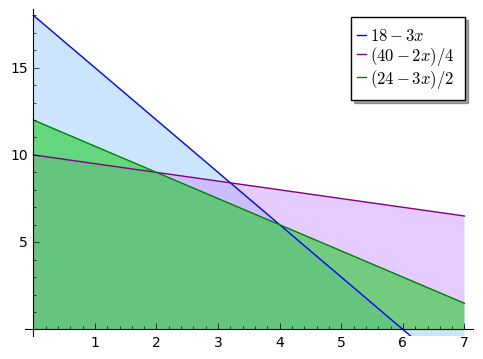
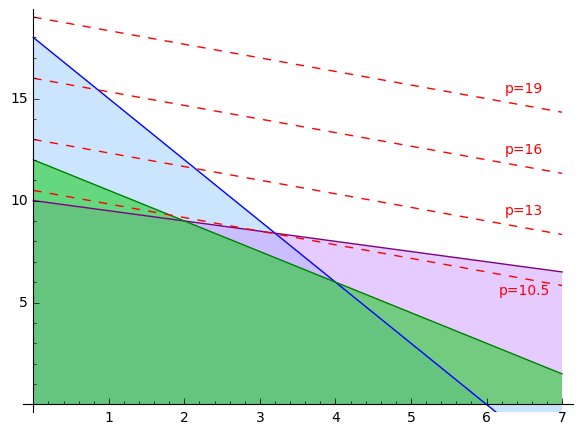
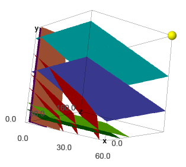

Linear Programming
------------------

The content of this book as well as quick search in the internet suggest that linear algebra is a branch of mathematics that concerns linear equations, linear operators and their matrix representations. Nevertheless it can be successfully applied to optimize a given expression under certain (linear) constraints. We illustrate some of the techniques, known as *linear programming*, on the following problems:

**The diet problem**

There are :math:`\ m\ ` different types of food, :math:`\ F_1,\ldots , F_m\ `,
that supply varying quantities of the :math:`\ n\ ` nutrients, 
:math:`\ N_1,\ldots , N_n\ `, that are essential to good
health. Let :math:`\ b_j\ ` be the minimum daily requirement of nutrient 
:math:`\ N_j\ `. Let :math:`\ c_i\ ` be the price of
unit of food :math:`\ F_i\ `. Let :math:`\ a_{ji}\ ` be the amount of nutrient 
:math:`\ N_j\ ` contained in one unit of food :math:`\ F_i\ `.
The problem is to supply the required nutrients at minimum cost.

In order to solve this problem we have to find the amount :math:`\ x_i\ ` of food :math:`\ F_i\ `,
:math:`\ i\in\left\{ 1, 2,\ldots ,m\right\}`, that one have to buy so that the overall cost 

.. math::

    c_1x_1 + \ldots + c_mx_m
    
is minimal and daily requirement for the nutrient :math:`\ N_j` is satisfied:

.. math::

    a_{j1}x_1+ \ldots + a_{jm}x_m \geq b_j\,.
    
In other words, we have to solve *the Standard Minimum Problem* :

.. math::

    \begin{array}
    \text{minimize:} &  c_1x_1 + \ldots + c_mx_m\\
    \text{constraints:} & a_{j1}x_1+ \ldots + a_{jm}x_m \geq b_j\, ,\quad j\in\left\{ 1,\ldots ,n\right\}\\
    & x_i\geq 0 \, ,\quad i\in\left\{ 1,\ldots ,m\right\}\\
    \end{array}
    
The last constraint represents the fact that one cannot buy a negative amount of food.

**The optimal allocation problem**

A company produces :math:`\ n\ ` types of products,  :math:`\ P_1,\ldots , P_n\ `, out of 
:math:`\ m\ ` types of resources,  :math:`\ R_1,\ldots , R_m\ `.
One unit of the product :math:`\ P_i\ ` brings :math:`\ p_i\ ` of profit and requires :math:`\ a_{ij}\ `
units of the resource :math:`\ R_j\ `, 
:math:`\ i\in\left\{ 1, 2,\ldots ,n\right\}\, ,\ j\in\left\{ 1, 2,\ldots ,m\right\}\ `.
The problem is to maximize the profit if there are only :math:`\ r_j\ ` units of the resource 
:math:`\ R_j\ `, :math:`\ j\in\left\{1,\ldots , J\right\}\ `.

This problem is very similar to the diet problem, but this time asks for optimal numbers 
:math:`\ y_i\ ` of products :math:`\ P_i\ ` that should be produced so that the profit is maximal.
This represents *the Standard Maximum Problem* :

.. math::

    \begin{array}
    \text{maximize:} &  y_1p_1 + \ldots + y_np_n\\
    \text{constraints:} & y_1a_{1j}+ \ldots + y_na_{nj} \leq r_j\, ,\quad j\in\left\{ 1,\ldots ,m\right\}\\
    & y_i\geq 0 \, ,\quad i\in\left\{ 1,\ldots ,n\right\}\\
    \end{array}
    
**The transportation problem**

There are :math:`\ I\ ` ports, or production plants, :math:`\ P_1,\ldots , P_I\ `, 
that supply a certain commodity, and there are :math:`\ J\ ` markets, 
:math:`\ M_1,\ldots , M_J\ `, to which this commodity must be shipped. 
Port :math:`\ P_i\ ` possesses an amount :math:`\ s_i\ ` of the commodity 
(:math:`\ i\in\left\{ 1, 2,\ldots ,I\right\}\ `), and market :math:`\ M_j\ ` 
must receive the amount :math:`\ r_j\ ` of the commodity 
(:math:`\ j\in\left\{ 1,\ldots ,J\right\}\ `). 
Let :math:`\ b_{ij}\ ` be the cost of transporting one unit of the commodity
from port :math:`\ P_i\ ` to market :math:`\ M_j\ `. The problem is to meet the market requirements at minimum
transportation cost.

Denote by :math:`\ x_{ij}\ ` the amount of commodity that is shipped from :math:`\ P_i\ `
to :math:`\ M_j\ `. Then the problem can be stated as follows:

.. math::

    \begin{array}
    \text{minimize:} &  \sum_{i=1}^I\sum_{j=1}^J b_{ij}x_{ij}\\
    \text{constraints:} & \sum_{j=1}^J x_{ij} \leq s_i\, ,\quad i\in\left\{ 1,\ldots ,I\right\}\\
    & \sum_{i=1}^I x_{ij} \geq r_j\, ,\quad j\in\left\{ 1,\ldots ,J\right\}\\
    & x_{ij}\geq 0 \, ,\quad i\in\left\{ 1,\ldots ,I\right\},\, j\in\left\{ 1,\ldots ,J\right\}\\
    \end{array}

.. note:: 

    Observe that to maximize the values of some function :math:`f(x)` is the same as to minimize the values of :math:`-f(x)`. 
    Therefore every standard maximum problem can be easily transformed to a standard minimum problem and vice versa:
    
    .. math::
    
        \begin{array}
        \text{maximize:} & c_1x_1 + \ldots + c_mx_m \\
        \text{constraints:} & a_{j1}x_1+ \ldots + a_{jm}x_m \leq b_j\, ,\quad j\in\left\{ 1,\ldots ,n\right\}\\
        & x_i\geq 0 \, ,\quad i\in\left\{ 1,\ldots ,m\right\}\\
        \end{array}
        
    is equivalent to
    
    .. math::
    
        \begin{array}
        \text{minimize:} & -(c_1x_1 + \ldots + c_mx_m)\\
        \text{constraints:} & -a_{j1}x_1- \ldots - a_{jm}x_m \geq -b_j\, ,\quad j\in\left\{ 1,\ldots ,n\right\}\\
        & x_i\geq 0 \, ,\quad i\in\left\{ 1,\ldots ,m\right\}\\
        \end{array}
    

The Geometric Method
~~~~~~~~~~~~~~~~~~~~

If the expression to minimize/maximize contains only 2 or 3 unknowns, the problem can be solved graphically.

**Example 1.**

One company produces two products :math:`P_1` and :math:`P_2` out of three resources :math:`R_1, R_2, R_3`. 
The amount of resources which are necessary for production as well as their availability is given in the following table:

+-------------+-------------+------------+--------------+
|             | :math:`P_1` | :math:`P_2`| Availability | 
+=============+=============+============+==============+
| :math:`R_1` | 3           | 1          | 18           |
+-------------+-------------+------------+--------------+
| :math:`R_2` | 2           | 4          | 40           | 
+-------------+-------------+------------+--------------+
| :math:`R_3` | 3           | 2          | 24           | 
+-------------+-------------+------------+--------------+

| The profit from products :math:`P_1` and :math:`P_2` is respectively $2 and $3.
| How many items of :math:`P_1` and :math:`P_2` should be produced so that the profit is maximal?

Denote by :math:`x` and :math:`y` the number of items of :math:`P_1` and :math:`P_2` respectively.
The problem can be written in a concise form as

.. math::

    \begin{array}
    \text{maximize:} &  2x + 3y\\
    \text{constraints:} & 3x+y \leq 18 \,,\\
    & 2x+ 4y \leq 40 \,,\\
    & 3x+ 2y \leq 24 \,,\\
    & x, y\geq 0 \,.\\
    \end{array}

The constraints determine the *feasible set* of solutions to the problem. To draw this region,
we first draw the lines which mark its boundaries, that is, :math:`\ y = 18-3x,\ 4y = 40-2x,\ 2y=24-3x\ `,
and then mark the region below the lines (with :math:`x, y\geq 0`):

.. code-block:: python

    sage: l1=plot(18-3*x, (x, 0, 7), fillcolor=(3/5, 4/5, 1),fill=0,legend_label='$18-3x$')
    sage: l2=plot((40-2*x)/4, (x, 0, 7), color="purple", fillcolor=(4/5, 3/5, 1), fill='axis',legend_label='$(40-2x)/4$')
    sage: l3=plot((24-3*x)/2, (x, 0, 7), color="green", fillcolor=(0,4/5,0), fill='axis',legend_label='$(24-3x)/2$')
    sage: (l1+l2+l3).show(figsize=5, ymin=0)
    

The picture tells us that the points :math:`(x, y)` that satisfy all the requirements lie in the polygon 
determined by the points :math:`(0,0),(0,10),(2,9),(4,6),(6,0)`. We want to maximize the profit function 
:math:`\ p=2x+3y\ `. In order to find out for which values of :math:`x, y` the constant :math:`p` is biggest,
we add a few lines :math:`\ 3y=p-2x\ ` to the picture above:

Now it's clear that the maximal profit is obtained at the point :math:`(x,y)=(2,9)` 
as this is the point within the polygon which the line :math:`\ 3y=p-2x\ ` touches first.
The point :math:`(x,y)=(2,9)` represents 2 items of the product :math:`P_1` and 9 items of the product :math:`P_2`; 
the profit is :math:`\ p=2\cdot 2+3\cdot 9=$31`.

**Example 2.**

Consider the following diet problem:

+-------------+--------------+-----------------------+-----------------+-----------------------+
| Food        | Cost/serving | Vitamin A (min 0.9 mg)| Iron (min 8 mg) | Calcium (min 1000 mg) |
+=============+==============+=======================+=================+=======================+
| Corn        | $ 0.18       | 0.009 mg              | 0.52 mg         | 2 mg                  |
+-------------+--------------+-----------------------+-----------------+-----------------------+
| 2% milk     | $ 0.23       | 0.028 mg              | 0.02 mg         | 120 mg                | 
+-------------+--------------+-----------------------+-----------------+-----------------------+
| Wheat bread | $ 0.05       | 0 mg                  | 0.8 mg          | 20 mg                 |
+-------------+--------------+-----------------------+-----------------+-----------------------+

Denote by :math:`x, y` and :math:`z` the number of servings of corn, milk and bread, respectively. 
The problem of minimizing the expenditure while providing sufficient amount of vitamine A, iron and calcium
may be summarized as follows:

.. math::

    \begin{array}
    \text{minimize:} &  0.18x + 0.23y + 0.05z\\
    \text{constraints:} & 0.009x+0.028y \geq 0.9 \,,\\
    & 0.52x+ 0.02y + 0.8z \geq 8 \,,\\
    & 2x+ 120y + 20z\geq 1000 \,,\\
    & x, y, z\geq 0 \,.\\
    \end{array}

Even though this problem can be still represented geometrically, it is much harder to see what the feasible set is and at which point the cost function :math:`\ c=0.18x + 0.23y + 0.05z\ ` achieves the minimum. 

(To draw the picture we used the function ``implicit_plot3d()``.)

In this picture the cost surfaces are denoted by the red color. The first plane :math:`0.009x+0.028y= 0.9` is marked by blue, the second by purple, and the last one by green color. The remaining three planes in lighter colours are parallel to the corresponding planes in darker colours and are drawn to facilitate picturing the feasible set; they show direction of the constraints. The yellow ball is the point with maximal coordinates at this picture: :math:`(60,60,160)`. 

The picture suggests that the place at which the red plane touches the feasible set first is located on the intersection of the blue and purple plane: the red planes that are closer to the origin do not contain any feasible points yet as they are below the restriction given by the blue plane.

Of course, if the problem is more complex and deals with several variables (what often happens in practice), we need more powerful tool than just illustration of the problem. And this is where linear algebra comes into play.

The Simplex Method
~~~~~~~~~~~~~~~~~~

The algorithm was invented by an American mathematician George Dantzig in 1940s. 

We demonstrate a solution of *the Standard Minimum Problem* with :math:`m` unknowns :math:`x_1,\ldots, x_m\geq 0` and :math:`n+m` constraints:

.. math::

    \begin{array}
    \text{minimize:} &  c_1x_1 + \ldots + c_mx_m\\
    \text{constraints:} & a_{j1}x_1+ \ldots + a_{jm}x_m \geq b_j\, ,\quad j\in\left\{ 1,\ldots ,n\right\}\\
    & x_i\geq 0 \, ,\quad i\in\left\{ 1,\ldots ,m\right\}\\
    \end{array}

which may be written in a matrix form as

.. math::

    \begin{array}
    \text{minimize:} &  \boldsymbol{c}^T\boldsymbol{x}\\
    \text{constraints:} & \boldsymbol{A}\boldsymbol{x} \geq \boldsymbol{b}\\
    & \boldsymbol{x}\geq 0,\\
    \end{array}

where

.. math::

   \boldsymbol{c}\,=\,\left[\begin{array}{c} 
                         c_{1} \\ \vdots \\ c_{m} 
                      \end{array}\right]\,,
   \qquad
   \boldsymbol{x}\,=\,\left[\begin{array}{c} 
                         x_{1} \\ \vdots \\ x_{m} 
                      \end{array}\right]\,,
   \qquad
   \boldsymbol{A}\  =\  \left[\;\begin{array}{ccc}
                           a_{11} & \ldots & a_{1m} \\
                           \vdots & \ddots & \vdots \\
                           a_{n1} & \ldots & a_{nm}
                        \end{array}\right]\,,
   \qquad
   \boldsymbol{b}\,=\,\left[\begin{array}{c} 
                         b_{1} \\ \vdots \\ b_{n} 
                      \end{array}\right]\,,
   
and by :math:`\ \boldsymbol{x}\geq 0\ ` (or :math:`\boldsymbol{A}\boldsymbol{x} \geq \boldsymbol{b}`) we mean that each coordinate of the vector :math:`\ \boldsymbol{x}\ ` (or :math:`\boldsymbol{A}\boldsymbol{x}-\boldsymbol{b}`) is greater or equal zero.

We will explain the consecutive steps along the way by referring to Example 1. discussed above, which we rewrite as the minimization problem:

.. math::

    \begin{array}
    \text{minimize:} &  -2x -3y\\
    \text{constraints:} & -2x -4y \geq -40 \,,\\
    & -3x -2y \geq -24 \,,\\
    & -3x-y \geq -18 \,,\\
    & x, y\geq 0 \,.\\
    \end{array}

.. admonition:: Step I: 

    Change the constraints :math:`\boldsymbol{A}\boldsymbol{x} \geq \boldsymbol{b}` into equalities by introducing new variables.

Observe that the constraint :math:`\ \boldsymbol{A}\boldsymbol{x} \geq \boldsymbol{b}\ ` may be equivalently written as 
:math:`\ \boldsymbol{w} =\boldsymbol{A}\boldsymbol{x} - \boldsymbol{b}\, ,\quad \boldsymbol{w}\geq 0\ `. 
Therefore the following problems are equivalent:

.. math::

    \begin{cases} min\quad \boldsymbol{c}^T\boldsymbol{x}\\
    \boldsymbol{A}\boldsymbol{x} \geq \boldsymbol{b}\\ 
    \boldsymbol{x}\geq 0\end{cases}
    \qquad\Longleftrightarrow\qquad
    \begin{cases} min\quad \left[\begin{array}{c} \boldsymbol{c}^T & \boldsymbol{0}^T\end{array}\right]
    \left[\begin{array}{c}\boldsymbol{x}\\ \boldsymbol{w}\end{array}\right]\\
    \left[\boldsymbol{A}\;\; -I\right]\left[\begin{array}{c}\boldsymbol{x}\\ \boldsymbol{w}\end{array}\right]
    =\boldsymbol{b}\\
    \boldsymbol{x},\, \boldsymbol{w}\geq 0
    \end{cases}
    
We simplify our notation:

    :math:`\left[\boldsymbol{A}\;\; -I\right]` is renamed :math:`\ \boldsymbol{A}\ `,
    :math:`\ \ \left[\begin{array}{c}\boldsymbol{x}\\ \boldsymbol{w}\end{array}\right]` is renamed :math:`\ \boldsymbol{x}\ `,
    :math:`\ \ \left[\begin{array}{c} \boldsymbol{c}\\ \boldsymbol{0}\end{array}\right]` is renamed :math:`\ \boldsymbol{c}\ `,
    
so that we have to solve the problem

.. math::

    \begin{array}
    \text{minimize:} &  \boldsymbol{c}^T\boldsymbol{x}\\
    \text{constraints:} & \boldsymbol{A}\boldsymbol{x} = \boldsymbol{b}\\
    & \boldsymbol{x}\geq 0,\\
    \end{array}

where :math:`\boldsymbol{A}` is :math:`n\times (m+n)` matrix and :math:`x` has :math:`m+n` components.

**Example.**

In case of Example 1., we obtain

.. math::

    \boldsymbol{A}=\left[\begin{array}{ccccc}
    -2 & -4 & -1 & 0 & 0\\ 
    -3 & -2 & 0 & -1 & 0\\
    -3 & -1 & 0 & 0 & -1\\
    \end{array}\right],\qquad
    \boldsymbol{b}=\left[\begin{array}{c} -40 \\ -24 \\ -18 \end{array}\right],\qquad
    \boldsymbol{c}=\left[\begin{array}{c} -2 \\ -3 \\ 0 \\ 0 \\ 0 \end{array}\right],\qquad
    \boldsymbol{x}=\left[\begin{array}{c} x \\ y \\ w_1 \\ w_2 \\ w_3 \end{array}\right].

.. admonition:: Step II: 

    Find a point that satisfies the constraints.

It is convenient to write down the data in the tableau: :math:`\ T=\left[\begin{array}{cc} \boldsymbol{A} & \boldsymbol{b}\\ \boldsymbol{c} & 0\end{array}\right]`. Recall that :math:`\boldsymbol{A}` is :math:`n\times (m+n)` matrix, and so it may be written as
:math:`[\boldsymbol{B}\;\; \boldsymbol{N}]\ ` where :math:`\boldsymbol{B}` is a square matrix of size :math:`n`, and :math:`\boldsymbol{N}` is :math:`n\times m` matrix. Similarly, we can write 
:math:`\ \boldsymbol{c}=\left[\begin{array}{c}\boldsymbol{c_B}\\ \boldsymbol{c_N}\end{array}\right]`, 
:math:`\ \boldsymbol{x}=\left[\begin{array}{c}\boldsymbol{x_B}\\ \boldsymbol{x_N}\end{array}\right]`, where 
:math:`\boldsymbol{c_B}`, :math:`\boldsymbol{x_B}` and :math:`\boldsymbol{c_N}`, :math:`\boldsymbol{x_N}` 
have respectively :math:`n` and :math:`m` components. In this way,

.. math::

    T=\left[\begin{array}{cccc} \boldsymbol{B} & \boldsymbol{N} & | & \boldsymbol{b}\\ 
    \boldsymbol{c_B} & \boldsymbol{c_N} & | & 0\end{array}\right]\,,\qquad 
    \boldsymbol{x}=\left[\begin{array}{c} \boldsymbol{x_B} \\ \boldsymbol{x_N}\end{array}\right],
    
which should be interpreted as 

.. math::

    \left[\begin{array}{cc} \boldsymbol{B} & \boldsymbol{N}\end{array}\right]
    \left[\begin{array}{c} \boldsymbol{x_B} \\ \boldsymbol{x_N}\end{array}\right]
    =\boldsymbol{b}\,,\qquad
    \left[\begin{array}{cc} \boldsymbol{c_B}^T & \boldsymbol{c_N}^T\end{array}\right]
    \left[\begin{array}{c} \boldsymbol{x_B} \\ \boldsymbol{x_N}\end{array}\right]
    =\boldsymbol{0}\, .

In order to find a point :math:`\boldsymbol{x_B}` which satisfies the constraints of the problem it suffices to perform Gauss Jordan elimination on the first :math:`n` rows of :math:`T` (i.e., excluding the last row) so that the submatrix :math:`[\boldsymbol{B}\; \boldsymbol{N}]` is in reduced row echelon form. This is equivalent to multiplication of these rows by :math:`\boldsymbol{B}^{-1}` on the left. We obtain:

.. math::

    T=\left[\begin{array}{cccc} \boldsymbol{I} & \boldsymbol{B}^{-1}\boldsymbol{N} & | & \boldsymbol{B}^{-1}\boldsymbol{b}\\ 
    \boldsymbol{c_B}^T & \boldsymbol{c_N}^T & | & 0\end{array}\right]\,,
    
which means that 

.. math::

        \boldsymbol{x_B} = -\boldsymbol{B}^{-1}\boldsymbol{N}\boldsymbol{x_N}+\boldsymbol{B}^{-1}\boldsymbol{b}\,,
        \qquad\qquad
        \text{cost:}\quad \boldsymbol{c_B}^T\boldsymbol{B}^{-1}\boldsymbol{b}\,.

**Example.**

In Example 1.,

.. math::

    T=\left[\begin{array}{ccccccc} 
    -2 & -4 & -1 & 0 & 0 & | & -40\\ 
    -3 & -2 & 0 & -1 & 0 & | & -24\\ 
    -3 & -1 & 0 & 0 & -1 & | & -18\\ 
    -2 & -3 & 0 & 0 &  0 & | & 0\\
    \end{array}\right]\,.

We use Sage to determine :math:`\boldsymbol{x_B}` and current cost.

.. code-block:: python

    sage: B=Matrix([[-2,-4,-1],[-3,-2,0],[-3,-1,0]])
    sage: N=Matrix([[0,0],[-1,0],[0,-1]])
    sage: b=Matrix([[-40],[-24],[-18]])
    sage: cB=Matrix([-2,-3,0])
    sage: cN=Matrix([0, 0])
    sage: T=block_matrix(QQ,[[B,N,b],[cB, cN, 0]])
    sage: T
    
    [ -2  -4  -1|  0   0|-40]
    [ -3  -2   0| -1   0|-24]
    [ -3  -1   0|  0  -1|-18]
    [-----------+-------+---]
    [ -2  -3   0|  0   0|  0]

Before we proceed, let's look what is actually happenning. The above table means that we are looking for a solution of the following system of equations:

.. math::

    \begin{alignat*}{7}
    -2x & \, - \, 4y & \, - \, w_1 & & & \; =\; & -40 \\
    -3x & \, - \, 2y & & \, - \, w_2 & & \; =\; & -24 \\
    -3x & \, - \, y & & & \, - \, w_3 & \; =\; & -18 
    \end{alignat*}

The division means that ultimately we care only about the variables :math:`x,y,w_1` and we will set later :math:`w_2=w_3=0`, 
that is, we want to solve 

.. math::

    \begin{alignat*}{5}
    -2x & \, - \, 4y & \, - \, w_1 & \; =\; & -40 \\
    -3x & \, - \, 2y &  & \; =\; & -24 \\
    -3x & \, - \, y  &  & \; =\; & -18 
    \end{alignat*}
    
If we look at the first picture from Example 1, this means that we want to compute the intersection point of the blue and the green line and under the condition that the point is under the purple line. 

From another point of view, if we write this system of equation in a column picture, this means that
we want to find constants :math:`x,y,w_1` so that linear combination of vectors 
(or points :math:`\ (-2,-3,-3),\, (-4,-2,-1),\, (-1,0,0)\ `) gives the vector :math:`b` (the point :math:`\ (-40,-24,-18)\ `): 

.. math::

    \left[\begin{array}{r} -2\\ -3\\ -3\end{array}\right] x +  
    \left[\begin{array}{r} -4\\ -2\\ -1\end{array}\right] y +
    \left[\begin{array}{r} -1\\ 0\\ 0\end{array}\right] w_1 =
    \left[\begin{array}{r} -40\\ -24\\ -18\end{array}\right]

Geometrically, this means that we consider a plane determined by the points :math:`\ (-2,-3,-3),\, (-4,-2,-1),\, (-1,0,0)\ ` 
and containing the point :math:`\ (-40,-24,-18)\ `.

We use Sage to compute :math:`x,y,w_1`:

.. code-block:: python

    sage: Tr=block_matrix([[B.inverse(),zero_matrix(3,1)],[zero_matrix(1,3),1]])*T
    sage: Tr
    
    [    1     0     0| -1/3   2/3|    4]
    [    0     1     0|    1    -1|    6]
    [    0     0     1|-10/3   8/3|    8]
    [-----------------+-----------+-----]
    [   -2    -3     0|    0     0|    0]

Hence,

.. math::

    \begin{alignat*}{3}
    x &\; =\; & \frac13 w_2 &\, -\,\frac23 w_3 & \, +\, 4\\
    y &\; =\; & -w_2 & \, +\, w_3 &\, +\, 6\\
    w_1 &\; =\; & \frac{10}{3} w_2 & \, -\,\frac83 w_3 & \, +\, 8
    \end{alignat*}

and if we set :math:`w_2=w_3=0`, we obtain :math:`(x,y,w_1)=(4,6,8)` which corresponds to the point :math:`(4,6)`, the intersection of the blue and the green line, as expected.

The cost at this corner is equal to 

.. math::

    \left[\begin{array}{ccc} -2 & -3 & 0 \end{array}\right] \left[\begin{array}{c} 4 \\ 6\\ 8 \end{array}\right]
    = -24 .

.. admonition:: Step III:

    Is the cost at this point lowest possible?

**Example.**

Consider Example 2. from the previous section. It can be written in a matrix form as follows:

.. math:: 

    \begin{array}{ll}
    minimize: & \left[\begin{array}{ccc} 0.18 & 0.23 & 0.05\end{array}\right] 
    \left[\begin{array}{c} x_1\\ x_2\\ x_3\end{array}\right]\\    
    \text{constraints:} & 
    \left[\begin{array}{ccc} 0.009 & 0.028x_2 & 0\\ 0.52 & 0.02 & 0.8x_3\\ 2 & 120 & 20\end{array}\right]
    \left[\begin{array}{c} x_1\\ x_2\\ x_3\end{array}\right]
    \geq\left[\begin{array}{c} 0.9\\ 8\\ 1000\end{array}\right]\,,\\    
    & \quad x_1, x_2, x_3\geq 0
    \end{array}
    
or equivalently:

.. math::

    \begin{array}
    \text{minimize:} &  \boldsymbol{c}^T\boldsymbol{x}\\
    \text{constraints:} & \boldsymbol{A}\boldsymbol{x} = \boldsymbol{b}\\
    & \boldsymbol{x}\geq 0,\\
    \end{array}
    
where

.. math::

    \boldsymbol{c} = \left[\begin{array}{c} 0.18 \\ 0.23 \\ 0.05 \\ 0\\ 0\\ 0\end{array}\right] \,,\quad
    \boldsymbol{x} = \left[\begin{array}{c} x_1\\ x_2\\ x_3 \\ x_4\\ x_5\\ x_6\end{array}\right]  \,,\quad
    \boldsymbol{A} = \left[\begin{array}{cccccc} 
        0.009 & 0.028 & 0 & -1 & 0 & 0\\ 
        0.52 & 0.02 & 0.8 & 0 & -1 & 0\\ 
        2 & 120 & 20 & 0 & 0 & -1\end{array}\right]\,,\quad
    \boldsymbol{b} = \left[\begin{array}{c} 0.9\\ 8\\ 1000 \\ 0\\ 0\\ 0\end{array}\right]\,.
    
Therefore the tableau is of the form:

.. math::

    T=\left[\begin{array}{cccccccc} 
        0.009 & 0.028 & 0 & -1 & 0 & 0 & | & 0.9\\ 
        0.52 & 0.02 & 0.8 & 0 & -1 & 0 & | & 8\\
        2 & 120 & 20 & 0 & 0 & -1 & | & 1000\\
        0.18 & 0.23 & 0.05 & 0 & 0 & 0 & | & 0\\
    \end{array}\right]\,.
    
To perform the next step we use Sage:

.. code-block:: python

    sage: B = Matrix([[0.009, 0.028, 0],[0.52, 0.02, 0.8],[2, 120, 20]])
    sage: N = Matrix([[-1, 0, 0],[0, -1, 0],[0, 0, -1]])
    sage: b = vector([0.9, 8, 1000])
    sage: print B.inverse()*N, "\n"
    sage: print B.inverse()*b
    
    [   -86.3751355258403   -0.505963136971449   0.0202385254788580]
    [   -7.95084929526563    0.162631008312252 -0.00650524033249006]
    [    56.3426093241778   -0.925189736176364  -0.0129924105529454]
    
    (61.5468015901699, 12.3599566317311, -30.3144199494037)
    
Hence, the tableau is

.. math::

    T=\left[\begin{array}{cccccccc} 
        1 & 0 & 0 & -86.3751355258403 & -0.505963136971449 &  0.0202385254788580  & | & 61.5468015901699\\ 
        0 & 1 & 0 & -7.95084929526563 &  0.162631008312252 & -0.00650524033249006 & | & 12.3599566317311\\
        0 & 0 & 1 & 56.3426093241778  & -0.925189736176364 & -0.0129924105529454  & | & -30.3144199494037)\\
        0.18 & 0.23 & 0.05 & 0 & 0 & 0 & | & 0\\
    \end{array}\right]\,.
    
After we subtract from the last row the first row multiplied by 
:math:`\ \boldsymbol{c_B}=\left[\begin{array}{ccc} 0.18 & 0.23 & 0.05\end{array}\right]\ ` from the left, 

.. code-block:: python

    sage: cB = vector([0.18, 0.23, 0.05])
    sage: cN = vector([0, 0, 0])
    sage: print cN-cB*B.inverse()*N
    sage: print -cB*B.inverse()*b
    
    (14.5590892663535, 0.0999277195518612, -0.00149710878207445)
    -12.4054933140585

we obtain

.. math::

    T=\left[\begin{array}{cccccccc} 
        1 & 0 & 0 & -86.3751355258403 & -0.505963136971449 &  0.0202385254788580  & | & 61.5468015901699\\ 
        0 & 1 & 0 & -7.95084929526563 &  0.162631008312252 & -0.00650524033249006 & | & 12.3599566317311\\
        0 & 0 & 1 & 56.3426093241778  & -0.925189736176364 & -0.0129924105529454  & | & -30.3144199494037)\\
        0 & 0 & 0 & 14.5590892663535  & 0.0999277195518612 & -0.00149710878207445 & | & -12.4054933140585\\
    \end{array}\right]\,.
    
Because one of the entries of :math:`\ \boldsymbol{c_N}=\left[\begin{array}{ccc} 14.5590892663535  & 0.0999277195518612 & -0.00149710878207445\end{array}\right]\ ` is negative, the cost :math:`12.4054933140585` is not optimal.

We look at the column above the negative entry (the 6th column in the tableau): :math:`(0.0202385254788580, -0.00650524033249006, -0.0129924105529454)^T` and consider the quotients :math:`\frac{t_{17}}{t_{16}}, \frac{t_{27}}{t_{26}}, \frac{t_{37}}{t_{36}}`, where :math:`t_{ij}` denote entries in the tableau:

.. math::

    \frac{t_{17}}{t_{16}}=3041.07142857143\,,\qquad
    \frac{t_{27}}{t_{26}}=-1900.00000000000\,,\qquad
    \frac{t_{37}}{t_{36}}=2333.24061196106\,.
    
Because the third ratio is the smallest positive number, we replace the third column in the tableau with the 6th column:    

.. math::

    T=\left[\begin{array}{cccccccc} 
        1 & 0 & 0.0202385254788580   & -86.3751355258403 & -0.505963136971449 & 0 & | & 61.5468015901699\\ 
        0 & 1 & -0.00650524033249006 & -7.95084929526563 &  0.162631008312252 & 0 & | & 12.3599566317311\\
        0 & 0 & -0.0129924105529454  & 56.3426093241778  & -0.925189736176364 & 1 & | & -30.3144199494037)\\
        0 & 0 & -0.00149710878207445 & 14.5590892663535  & 0.0999277195518612 & 0 & | & -12.4054933140585\\
    \end{array}\right]\,.
    
We return to the notation 

.. math::

    T=\left[\begin{array}{cccc} \boldsymbol{B} & \boldsymbol{N} & | & \boldsymbol{b}\\ 
    \boldsymbol{c_B} & \boldsymbol{c_N} & | & 0\end{array}\right].
    
and repeat the step above until all the entries of :math:`\boldsymbol{c_N}` are non-negative.
The next tableau in the reduced form is

.. math::

    T=\left[\begin{array}{cccccccc} 
        1 & 0 & 0 & 1.39082058414489  & -1.94714881780251  & 1.55771905424201  & | & 14.3254520166897\\ 
        0 & 1 & 0 & -36.1613351877608 & 0.625869262865092  & -0.500695410292073 & | & 27.5382475660640\\
        0 & 0 & 1 & -4336.57858136301 & 71.2100139082060   & -76.9680111265648 & | & 2333.24061196106\\
        0 & 0 & 0 & 8.06675938803897  & 0.206536856745480  & -0.115229485396384 & | & 3.49311501085967\\
    \end{array}\right]\,.

We see that again not all the entries of :math:`\boldsymbol{c_N}` are non-negative. As before, we compare the quotients:

.. math::

    \frac{t_{17}}{t_{16}}=9.19642857142845\,,\qquad
    \frac{t_{27}}{t_{26}}=-54.9999999999999\,,\qquad
    \frac{t_{37}}{t_{36}}=-30.3144199494037\,.
    
The smallest positive quotient occurs in the first ratio, so we exchange the first and the 6th column in the tableau:

.. math::

    T=\left[\begin{array}{cccccccc} 
        1.55771905424201  & 0 & 0 & 1.39082058414489  & -1.94714881780251  & 1 & | & 14.3254520166897\\ 
        -0.500695410292073 & 1 & 0 & -36.1613351877608 & 0.625869262865092  & 0 & | & 27.5382475660640\\
        -76.9680111265648 & 0 & 1 & -4336.57858136301 & 71.2100139082060   & 0 & | & 2333.24061196106\\
        -0.115229485396384 & 0 & 0 & 8.06675938803897  & 0.206536856745480  & 0 & | & 3.49311501085967\\
    \end{array}\right]\,,
    
and then present it in the reduced form:

.. math::

    T=\left[\begin{array}{cccccccc} 
        1 & 0 & 0 & 0.892857142857297  & -1.2499999999999984 & 0.6419642857142834  & | & 9.196428571428445\\ 
        0 & 1 & 0 & -35.71428571428568 &      0              & 0.32142857142857084 & | & 32.14285714285711\\
        0 & 0 & 1 & -4267.8571428571395 & -24.999999999999957 & 49.410714285714214 & | & 3041.0714285714234\\
        0 & 0 & 0 & 8.169642857142907  &    0.0625           & 0.07397321428571423 & | & 1.0596997317703043\\
    \end{array}\right]\,.
