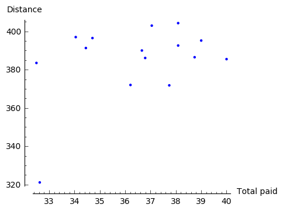
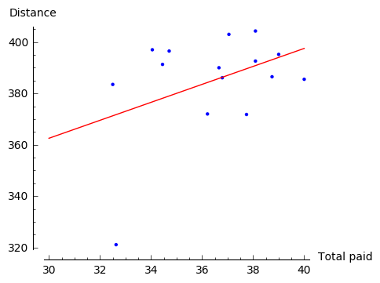
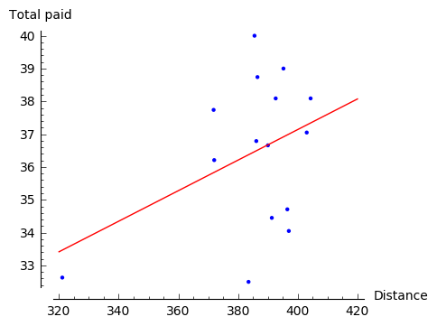
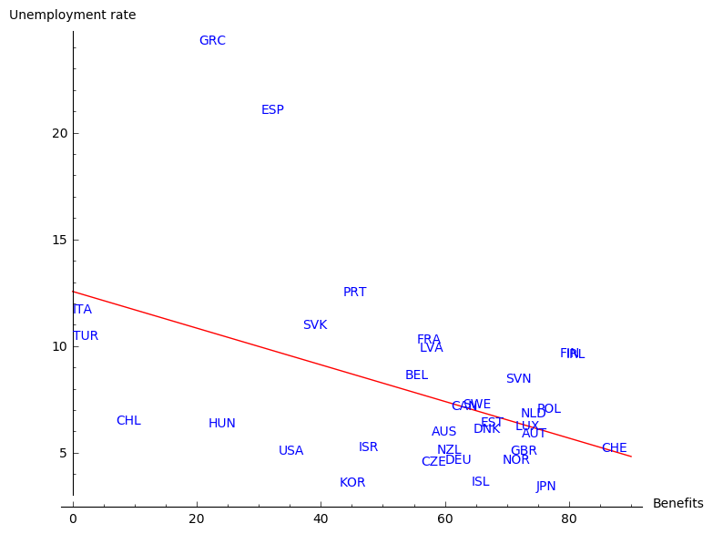
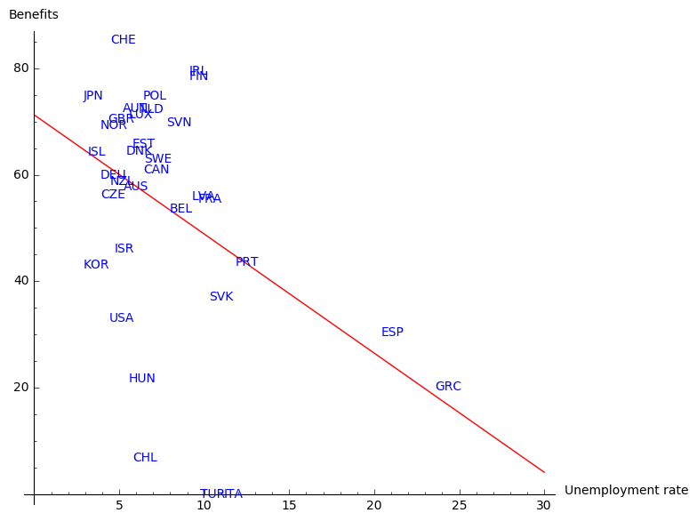
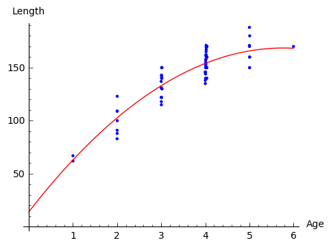

Linear and Polynomial Regression
--------------------------------

*Regression analysis* is a technique to create statistical models describing the relationshp between *dependent variables* and *explanatory variables* (or *independent variables*). Depending on the type of this relationship (shape of the best fitted curve), the number of dependent and independent variables, and whether they are of continuous or binary nature, one applies different type of regression. If chosen properly, it helps to predict future behaviour basing on a data from the past (e.g. to assess risk in financial services, goods prices or consumer behaviour) as well as explore correlation between the objects. Here we disccuss only linear and polynomial dependencies; the interested reader is referred to https://www.analyticsvidhya.com/blog/2015/08/comprehensive-guide-regression/ for a brief description of a few other methods.

Linear Regression
~~~~~~~~~~~~~~~~~

This is the oldest type of regression. In the simplest case there is only one independent and one dependent variable, that is, data related to certain phenomenon consists of points 
:math:`\ (x_1,y_1),\, (x_2,y_2),\, \ldots,\, (x_n,y_n)\ ` which indicate *linear* dependence. To find this dependence one looks for a straight line which best fits the data. This can be done by minimalising the distance between the points and the desired line: the *ordinary least squares* method. Namely, one has to determine the matrix :math:`\ B\ ` such that 

.. math::

    X^Ty=X^T\cdot XB,
    
    \text{where}
    
    y=\left[\begin{matrix} y_1\\ y_2\\ \vdots \\ y_n \end{matrix}\right]\, ,\qquad
    X=\left[\begin{matrix} 1 & x_1\\ 1 & x_2\\ \vdots & \vdots \\ 1 & x_n \end{matrix}\right]\, ,\qquad
    B=\left[\begin{matrix} \beta_1\\ \beta_2 \end{matrix}\right]\, .

Note that if not the presence of the matrix :math:`\ X^T\ ` on both sides of the equality, this matrix equation would have the form :math:`\ y=XB\ `, that is, it would describe solutions of the system of equations

.. math::

   \begin{array}{c}
   y_1\ \, = \, \beta_1\; +\; x_1\,\beta_2\\
   y_2\ \, = \, \beta_1\; +\; x_2\,\beta_2\\
   \vdots\ \ \quad\quad\qquad\vdots\qquad\ \\
   y_n\ \, = \, \beta_1\; +\; x_n\,\beta_2
   \end{array}

suggesting that each data point lies on the same line. However, in general such situation does not take place, and thus such a simple system would not have any solution.

On the other hand, if only the (square) matrix :math:`\ X^T\cdot X\ ` is invertible, the equation :math:`\ X^Ty=X^T\cdot XB\ ` has a solution for :math:`\ B=(X^T\cdot X)^{-1} X^Ty\ `. This gives the line that best fits the data:

.. math::

    y=\beta_1 + x\beta_2\, ,\qquad\text{where}\,\qquad 
    \left[\begin{matrix} \beta_1\\ \beta_2 \end{matrix}\right]=B=(X^TX)^{-1}X^Ty\, .

**Example 1.** [1]_

Assume that you go for a long trip and want to predict how much money you should allocate for petrol and when you should stop to fill up the tank.
You have observed the efficiency of your car and collected the following data:

========== ===== ===== ===== ===== ===== ===== ===== ===== ===== ===== ====== ===== ===== ===== =====
Total paid 36.66 37.05 34.71 32.5  32.63 34.45 36.79 37.74 38.09 38.09 38.74  39    40    36.21 34.05
---------- ----- ----- ----- ----- ----- ----- ----- ----- ----- ----- ------ ----- ----- ----- -----
Distance   390   403   396.5 383.5 321.1 391.3 386.1 371.8 404.3 392.6 386.49 395.2 385.5 372   397 
========== ===== ===== ===== ===== ===== ===== ===== ===== ===== ===== ====== ===== ===== ===== =====
 
Of course, this data carries an error of measurement and depends on fluctuation of petrol prices, but overall there should be a linear dependence between how much money you pay and how far you can drive with the petrol you bought. This seems to be confirmed by the graph of the data points:

Hence, it makes sense to apply linear regression.

.. code-block:: python

    sage: xl=[36.66, 37.05, 34.71, 32.5, 32.63, 34.45, 36.79, 37.74, 38.09, 38.09, 38.74, 39, 40, 36.21, 34.05]
    sage: yl=[390, 403, 396.5, 383.5, 321.1, 391.3, 386.1, 371.8, 404.3, 392.6, 386.49, 395.2, 385.5, 372, 397]
    sage: X=matrix([[1,xl[i]] for i in range(len(xl))])
    sage: y=vector(yl)
    sage: B=(X.transpose()*X).inverse()*X.transpose()*y
    sage: P=points([(xl[i],yl[i]) for i in range(len(xl))])
    sage: l=line([(30,B[0]+B[1]*30),(40,B[0]+B[1]*40)],color='red')
    sage: print 'line: y =', B[0], '+', B[1], '* x'
    sage: show(P+l,axes_labels=['Total paid','Distance'],axes_labels_size=1,figsize=5) 
    
    line: y = 257.569072517769 + 3.49884566266075 * x
    

Now it is very easy to find out how much on average one has to pay to drive :math:`y` km:

.. math::

    x=(y-257.569072517769)/3.49884566266075

.. admonition:: Experiment with Sage!

    How far would you like to drive? Check the outcome (an average cost) for various values of :math:`y` (distance).

.. sagecellserver::

    y=  # write the distance
    x=(y-257.569072517769)/3.49884566266075
    round(x,2) # rounds x to 2 decimal digits 

In the above example we skipped an important moment when one has to decide which variable depends on the other. As we will see below, this is not always a natural choice to make and wrong decision may lead to unreal results.

For instance, if in the above example we chose distance as an independent variable and applied the ordinary least squares method, we would obtain the following solution:

This does not lead yet to ridiculous consequences, but clearly it matches the data much less and suggests lack of linear relation. 

**Example 2.** (correlation)

Linear regression may be also used to investigate correlation between two phenomena: we say that two types of behaviour are *correlated* :math:`\,` if they manifest linear dependence.

We will investigate correlation between rate of unemployment in various countries and amount of benefits given by these countries. [2]_
This time our data is relatively large, so instead of rewriting it by hand, we simply open it with Sage. The data was downloaded [2]_, preprepared and saved in .csv file at the same place as the file we are working with. If the data was less complex and easily available in the internet, we could provide a suitable link or allocation of the file in the code below.

.. code-block:: python

    import csv
    file = 'Benefits_and_unemployment_2015.csv' # here we provide the name or the path of our .csv file
    reader = csv.reader(open(file))
    L = []
    for row in reader:
        L.append(row) # L is a list in form of a matrix which stores the content of file
    print L[0] # first row of L (names of the columns)
    print L[1] # second row of L (example of content)

    ['LOCATION', 'Country', 'Value-benefits', 'Value-unemployment']
    ['AUS', 'Australia', '57.8', '6.004402']

First we take an assumption that the unemployment rate depends on the amount of benefits.

.. code-block:: python

    # dependent variable: Value-unemployment
    xl=[L[i][2] for i in srange(1,35)] # srange: we omit the row L[0]
    yl=[L[i][3] for i in srange(1,35)]
    X=matrix(RDF,[[1,xl[i]] for i in range(len(xl))])
    y=vector(RDF,yl)
    B=(X.transpose()*X).inverse()*X.transpose()*y
    l=line([(0,B[0]),(90,B[0]+B[1]*90)],color='red')
    print 'line: y =', B[0], '+', B[1], '* x'
    pic=l 
    for i in range(34): # L[i+1][0] with i=0,1,... to omit the row L[0]
        pic+= text(L[i+1][0],(xl[i], yl[i]),horizontal_alignment='left',color='blue',fontsize='small')
    show(pic,axes_labels=['Benefits','Unemployment rate'],axes_labels_size=1) 
    
    line: y = 12.5620870752 + -0.0859490641839 * x

    
For the interested reader we provide explanation of the abbreviations used in the figure:

========= ======= ======= ====== ============== ======= ======= ====== ======= ====== ======= ======= 
   AUS      AUT     BEL    CAN       CZE          DNK     FIN    FRA    DEU     GRC    HUN      ISL        
--------- ------- ------- ------ -------------- ------- ------- ------ ------- ------ ------- -------  
Australia Austria Belgium Canada Czech Republic Denmark Finland France Germany Greece Hungary Iceland  
========= ======= ======= ====== ============== ======= ======= ====== ======= ====== ======= =======  

======= ===== ===== ===== ========== =========== =========== ====== ====== ======== =============== 
IRL      ITA   JPN   KOR     LUX         NLD         NZL       NOR    POL     PRT          SVK       
------- ----- ----- ----- ---------- ----------- ----------- ------ ------ -------- --------------- 
Ireland Italy Japan Korea Luxembourg Netherlands New Zealand Norway Poland Portugal Slovak Republic  
======= ===== ===== ===== ========== =========== =========== ====== ====== ======== =============== 

===== ====== =========== ====== ============== ============= ===== ======= ====== ======== ======
ESP    SWE     CHE        TUR     GBR              USA        CHL    EST    ISR     SVN     LVA
----- ------ ----------- ------ -------------- ------------- ----- ------- ------ -------- ------
Spain Sweden Switzerland Turkey United Kingdom United States Chile Estonia Israel Slovenia Latvia
===== ====== =========== ====== ============== ============= ===== ======= ====== ======== ======

The graph suggests that there is indeed a correlation between the amount of benefits 
and long term unemployment: the higher the benefits, the lower long term unemployment. 
The countries that hardly fit in this picture are Greece and Spain. This is not so surprising 
if we recall that these two countries (especially Greece) suffered from serious crisis in 2015.
There are, of course, a few other factors that should be taken into account to draw the right conclusion
in such a complex topic. We leave at this place as we start to drift away from the subject of this book.
The interested reader may compare the figure above with the graph on `Wikipedia page`_
presenting the relationship between poverty reduction and differing levels of welfare expense by different countries.

We finish this example with a graph presenting linear regression under assumption that the amount of benefits 
depends on the rate of unemployment. Perhaps: the lower unemployment, the more money for benefits?

    
This result seems to represent the actual situation in a worse manner. Nevertheless, it conveys the true fact:
if rate of unemployment in a given country crosses a critical point, the country will not have enough money for the benefits.
    
Polynomial Regression
~~~~~~~~~~~~~~~~~~~~~

The idea behind this method lies in finding a polynomial that best fits the data. The best fit may be achieved in the same way as for the linear regression: by applying the ordinary least squares method. We demonstrate it by looking for a polynomial of degree two, but the same technique may be easily generalised to polynomials of higher degree.

**Example 3.** [3]_

.. figure:: figures/regr-fish.jpg
    :scale: 15%
    :align: right

In 1981, n = 78 bluegills were randomly sampled from Lake Mary in Minnesota. 
The researchers (Cook and Weisberg, 1999) measured and recorded the data concerning length and age of the fish.
They were primarily interested in learning how the length of a bluegill fish is related to its age.
The data is available under the `link`_ .

We can access the data from the website above by the following code:

.. code-block:: python

    sage: import urllib2, ssl
    sage: ctx = ssl.create_default_context()
    sage: ctx.check_hostname = False
    sage: ctx.verify_mode = ssl.CERT_NONE

    sage: file=urllib2.urlopen("https://onlinecourses.science.psu.edu/stat501/sites/onlinecourses.science.psu.edu.stat501/files/data/bluegills/index.txt", context=ctx)
    
The first lines are necessary to overcome a problem of certificate validation for our url.
However, in order to perform any operations on the data, we have to open it as a .csv file.
Because the consecutive entries of the file are not separated by a comma but rather by a tabulator,
we have to specify the separator in the code. We write further:

.. code-block:: python

    sage: import csv
    sage: reader=csv.reader(file, delimiter='\t') # elements in the file are separated by tabulator \t and not by comma
    sage: L=[]
    sage: for row in reader:
    sage:     L.append(row)
    sage: print L[0], L[1]
    
    ['age', 'length'] ['1', '67']
    
The analysis starts with illustration of the data:

.. code-block:: python

    sage: xl=[L[i][0] for i in srange(1,len(L))] 
    sage: yl=[L[i][1] for i in srange(1,len(L))]
    sage: P=points([(xl[i],yl[i]) for i in range(len(xl))])
    sage: show(P,axes_labels=['Age','Length'],axes_labels_size=1, xmin=0, ymin=0,figsize=5)
    
.. figure:: figures/regr-pol.png
    :align: center

Since the picture resembles more a parabola than a line, 
we apply ordinary least squares method to find best fitting polynomial of the form

.. math::

    y=\beta_0 +\beta_1 x+\beta_2 x^2\qquad\text{ and denote }\qquad
    B=\left[\begin{matrix} \beta_0 \\ \beta_1\\ \beta_2 \end{matrix}\right]\, ,

that is, we determine the matrix :math:`\ B\ ` from the equation

.. math::

    X^Ty=X^TXB\,,
    
where

.. math::
    
    y=\left[\begin{matrix} y_1\\ y_2\\ \vdots \\ y_n \end{matrix}\right]\,\qquad\text{and}\qquad
    X=\left[\begin{matrix} 1 & x_1 & x_1^2\\ 1 & x_2 & x_2^2\\ \vdots & \vdots \\ 1 & x_n & x_n^2 \end{matrix}\right]\, .
    
Note that the only change in comparison with linear regression is the third column 
of matrix :math:`\ B\ ` consisting of second powers of data representing independent variables.
In order to find a polynomial of degree :math:`m` that best fits the data, 
one constructs the matrix :math:`\ X\ ` so that it has :math:`m+1` columns
and the :math:`j`-th column contains :math:`\ x_i^{j-1}\ `.

In this particular example we have a serious problem: 
the matrix :math:`\ X^TX\ ` is not invertible. This happens because independent variables
describing the age of fish are highly correlated: there are a few examples of fish which have the same age.
In general such situation indicates that the ordinary least square method cannot be used. However,    
in practice, the researchers probably did not take into account that the age of fish differed by a few days (or hours).
Hence, we can perturb the original age slightly, 
e.g. by :math:`0.001` which corresponds to age difference smaller than a day,
and still obtain a valid result.

We continue the code with:

.. code-block:: python

    sage: # small perturbation of the data so that there's only one fish of a given age
    sage: xlm=[0 for i in range(len(xl))]
    sage: for age in [1..6]:
    sage:     a=0
    sage:     for i in range(len(xl)):
    sage:         if RDF(xl[i])==age: 
    sage:             xlm[i]=RDF(xl[i])+0.001*a
    sage:             a=a+1

so that we can apply the ordinary least square method:

.. code-block:: python

    sage: P=points([(xlm[i],yl[i]) for i in range(len(xl))])
    sage: X=matrix(RDF,[[1,xlm[i],(xlm[i])^2] for i in range(len(xl))])
    sage: y=vector(RDF,yl)
    sage: B=(X.transpose()*X).inverse()*X.transpose()*y
    sage: x = var('x')
    sage: par=plot(B[2]*x^2+B[1]*x+B[0], (x,0,6),color='red')
    sage: print 'parabola: y =', B[0], '+', B[1], '* x', B[2], '* x^2'
    sage: show(P+par,axes_labels=['Age','Length'],axes_labels_size=1, xmin=0, ymin=0,figsize=5)
    
    parabola: y = 14.1077559995 + 53.5604249124 * x -4.64384272392 * x^2

Note that because of lack of information on bluegills at early age, the graph does not give a realistic value at the young age.

Exercises
~~~~~~~~~

**Exercise 1.**

a). Gather together the code from Example 3 in order to obtain the polynomial of degree 2 that best fits the data on bluegill fish. 

.. sagecellserver::

b). Use linear regression to add the best fitting line to the picture obtained above.

.. sagecellserver::

c). Add to the data the point :math:`\ (0,0)\ ` which represents additional information that length of the fish at the age 0 is 0.

    (The list ``xlm`` can be extended to contain :math:`0` as its first element by a command :math:`\,` ``xlm=[0]+xlm`` :math:`\,`.)

.. sagecellserver::

**Exercise 2.** [4]_

Indiana State University collected data on height and shoe size of its students. You can access this data by clicking `a link <http://visual.icse.us.edu.pl/LA/_static/shoesize.txt>`_. 

a). Use the data to verify whether there is a correlation between height and shoe size. Write the code in the window below.

.. sagecellserver::

	import urllib
	import csv
	reader = csv.reader(urllib.urlopen('http://visual.icse.us.edu.pl/LA/_static/shoesize.txt'))
	
	L=[]
	for row in reader:
	    L.append(row)
	print L[0]
	print L[1]

b). Now make another illustration of the data, where the data related to women is marked in a different colour. In order to do this define a separate list ``Fem`` which collects the indices corresponding to women responses. You can refer to these indices by writing ``for i in Set(Fem)`` in place of usual ``for i in range()``.

.. sagecellserver::

c). Use least square method to describe correlation between hight and shoe size of men (one line) and women (the other line). Present the results on the same picture.

.. sagecellserver::

**Exercise 3.** [5]_

Researchers Mackowiak, Wasserman and Levine collected data on body temperature and heart rate within male and female respondents. A sample of this data is available at http://ww2.amstat.org/publications/jse/datasets/normtemp.dat.txt . First column corresponds to body temperature (degrees Fahrenheit), second to the gender (1 = male, 2= female), and the third to the heart rate (beats per minute). 

a). Use this data to find whether there is a correlation between body temperture and heart beat. 

.. sagecellserver::

b). Does it matter whether the respondent is a man or a woman? As in Exercise 2 above, perform separate computations for male and female respondents.

.. sagecellserver::

.. [1] This example was inspired by the article https://towardsdatascience.com/linear-regression-in-real-life-4a78d7159f16 .

.. [2] | More precisely: unemployment was measured within people of age 15-64; 
         benefits show the proportion of net income in work that is maintained after 
         job loss when unemployment exceeds 5 years, this concerns a married couple with two children. 
         In both cases data comes from the year 2015. Source:
       | https://www.oecd-ilibrary.org/economics/data/labour/labour-force-statistics_data-00046-en (unemployment)
       | https://www.compareyourcountry.org/benefits-taxes-wages?cr=oecd&lg=en&page=0&visited=1 (benefits).  

.. [3] | This example was taken from https://onlinecourses.science.psu.edu/stat501/node/325/ .
       | The picture of a blue gill fish: https://en.wikipedia.org/wiki/Bluegill . 
       
.. [4] This exercise is based on the article and data of Constance H. McLaren, "Using the Height and Shoe Size Data to Introduce Correlation and Regression" available at http://ww2.amstat.org/publications/jse/v20n3/mclaren.pdf .

.. [5] This exercise is based on the article and data of Allen L. Shoemaker, "What's Normal? - Temperature, Gender, and Heart Rate" available at http://ww2.amstat.org/publications/jse/v4n2/datasets.shoemaker.html .

.. _link: https://onlinecourses.science.psu.edu/stat501/sites/onlinecourses.science.psu.edu.stat501/files/data/bluegills/index.txt 

.. _`Wikipedia page`: https://en.wikipedia.org/wiki/Welfare%27s_effect_on_poverty#/media/File:The_Antipoverty_Effect_of_Government_Spending_Vector_Graph.svg

