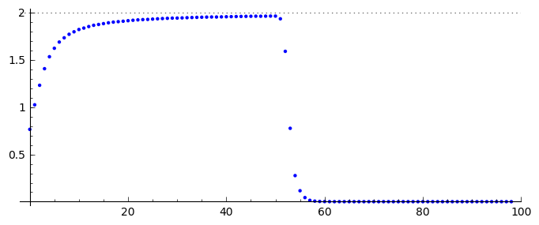

Models of interacting populations: prey-predator
================================================

The Lotka-Volterra model
------------------------

In this model we consider two populations: the population of prey and
the population of predators. Prey and predators can be reproduced by the
birth process. Population of prey is described by the function
:math:`N=N(t)` and population of predators - by :math:`P=P(t)`. As in
the Malthus model the rate of change of populations is the birth and
death process:

.. math:: \frac{dN}{dt} = a N - b N

.. math:: \frac{dP}{dt} = c P - e P

where the parameter :math:`a` characterizes the birth of prey, :math:`b`
corresponds to the death process of prey, :math:`c` describes the birth
process of predators and finally :math:`e` corresponds to the death
process of predators.

We assume that the death rate :math:`b` of prey depends upon the
population of predators: If there is a greater number of predators
:math:`P` then :math:`b` should be greater. In the simplest modeling we
assume that it is a linear function, i.e.,

.. math:: b \to  b_0 P

where :math:`b_0\gt 0` is a new parameter related to the death rate of
prey. Next, we assume that :math:`C` depends on the population :math:`N`
of prey: If there is a greater number of prey then the birth rate of
predators is greater, i.e.,

.. math:: c  \to  c_0 N

where :math:`c_0 \gt 0` characterizes the birth rate of predators. Under
these assumptions, the model reads

.. math:: \frac{dN}{dt} = a N - b_0 P N

.. math:: \frac{dP}{dt} = c_0 N P - e P

All parameters in this model are positive. This model was introduced by
V. Volterra in 1926 to describe population of fish. In 1920 A. J. Lotka
considered a similar equation to describe kinetics of some chemical
reactions. Therefore this model is called the Lotka-Volterra one. There
are 4 parameters. Haw many relevant parameters are in this model? To
answer this questions we have tp transform the set of two equations to
the dimensionles form. We introduce the following new resclaed variables
for populations: b

.. math:: x=\frac{c_0}{e} N, \quad y =\frac{b_0}{a} P

and dimensionless time (similarly as in the Verhulst model):

.. math:: \tau = a t

In the new variables the Lotka-Volterra set of equations is transformed
to the form

.. math:: \dot x= x- x y

.. math:: \dot y = \alpha (xy-y)

We note that only 1 relevant parameter occurs, i.e.,
:math:`\alpha = e/a \gt 0`. It is the ratio of the death rate of
predators :math:`e` to the birth rate of prey :math:`a`. The scaling
procedure allowed to eliminate irrelevant parameters of the model. There
is only one relevant parameter :math:`\alpha`. In consequence, solutions
of the Lotka-Volterra system depens on this parameter and initial
conditions :math:`[x(0), y(0)]`.

Stationary states of the system
~~~~~~~~~~~~~~~~~~~~~~~~~~~~~~~

Stationary states of the system are determined by a set of 2 algebraic
equations:

.. math:: f(x, y) = x- x y =0,  \quad g(x,y) = \alpha (xy - y) =0,

Hence we obtain two pairs of states:

.. math:: (x_1=0, y_1=0) \quad \mbox{or} \quad (x_2=1, y_2 =1)

Stability of the stationary states
~~~~~~~~~~~~~~~~~~~~~~~~~~~~~~~~~~

A. In the first step we have to calculate the Jacobi matrix:

.. math::

   \begin{aligned}
   J = \begin{bmatrix}\frac{ \partial f}{\partial x}&  \frac{\partial f}{\partial y}\\ \frac{\partial g}{\partial x}&  \frac{\partial g}{\partial y}  \end{bmatrix}
   \end{aligned}

B. Next, we calculate it for the stationary points:

.. math::

   \begin{aligned}
   J_1= J(0, 0) = \begin{bmatrix}1& 0\\ 0& -\alpha \end{bmatrix}, \quad \quad  J_2= J(1, 1) = \begin{bmatrix}0& -1\\ \alpha& 0 \end{bmatrix}
   \end{aligned}

C. We have to calculate the eigenvalues of the Jacobi matrix
   :math:`|J-\lambda I|=0`:

C1. For :math:`(0, 0)` we get:

:math:`\lambda_{01} = 1,\quad \lambda_{02} =- \alpha`.

This state is unstable because one of the eigenvalues is positive
:math:`\lambda_{01} \gt 0`. An arbitrary small perturbation causes the
escape from this state.

C2. For :math:`(1, 1)` we get:

:math:`\lambda_{11} = i \sqrt{\alpha}, \quad \lambda_{12} = -i\sqrt{\alpha}`.

Two eigenvalues are imaginary. Therefore this state is stable but not
asymptotically stable. An arbitrary small perturbation causes the
creation of a new time-dependent asymptotic state which is in the
vicinity of :math:`(1, 1)` but does not tends to :math:`(1, 1)`.

Phase curves
~~~~~~~~~~~~

We will obtain the phase trajectories or phase curves, i.e. the curves
on the plane :math:`(x, y)`. The phase curves are given by the
parametric relation :math:`(x(t), y(t))`. To get its form, we devide the
second equation by the first equation in the set of two Lotka-Volterra
equations. As a result, one has:

.. math:: \frac{dy}{dx}= \frac{\alpha y (x-1)}{x(1-y)}

It is a differential equation of the first order. It can be solved by
the method of variables separation:

.. math:: \left(\frac{1}{y} - 1\right) \; dy = \alpha \left(1-\frac{1}{x}\right)\; dx

The integration of both sides of this equation yields:

.. math:: \mbox{ln} y -y = \alpha (x- \mbox{ln} x) - H_0

where :math:`H_0` is the integration constant. Its value is determined
by initial conditions :math:`(x(0), y(0)`. The minimal value is for the
initial conditions :math:`(x(0)=1, y(0)=1)`> we insert these value to
the above equation and get :math:`H_0 = 1+\alpha`. Below we present 3
phase curves for various values of :math:`H_0` (i.e. for different
initial conditions). Because the relation between :math:`y` and
:math:`x` is an implicit equation its graphical realization can be
obtained by using of SAGE in the following way:

.. figure:: lotka_phase.png
   :scale: 100
   :align: center
   
   Phase curves of the Lotka-Volterra system. Red dot denote initial condition.

.. admonition:: Experiment with Sage!

    Investigate how parameters: initial condition :math:`x_0,y_0` and :math:`\alpha` change phase curves of the  Lotka-Volterra system.
    
.. sagecellserver::
    :linked: false
    
    var('x z a x0 y0')
    phase_curve = -z + log(z) == a*x - a*x0 - a*log(x) + a*log(x0) - y0 + log(y0)
    @interact
    def _(a_=slider(1e-2,2,0.1,default=1.0),
          x0_=slider(1e-3,4,0.04,default=1),
          y0_=slider(1e-3,5,0.04,default=1.2)):
        p = implicit_plot(phase_curve.subs(a==a_,x0==x0_,y0==y0_),(x,0,5),(z,0,5))
        p += point((x0_,y0_),color='red',size=15,legend_label='ic')
        p += point( (1,1),color='green',size=20,legend_label='fix point')
        p.show(figsize=4)

First, we note that the phase curves are closed. It means that the
solutions are periodic (oscillatory) functions of time. Secondly, the
increase of :math:`H_0` causes the increase of amplitude of
oscillations. Below we demonstrate it solving numerically the set of
Lotka-Volterra equations.

Time evolution in Lotka-Volterra systems
~~~~~~~~~~~~~~~~~~~~~~~~~~~~~~~~~~~~~~~~

The time dependence of :math:`x(t)` and :math:`y(t)` can easily be
obtained using the SAGE:

.. fig001:

.. figure:: lotka_voltera_t.png
   :alt: image
   :figclass: align-center

   Time evolution in Lotka-Volterra system

.. admonition:: Experiment with Sage!

    Investigate how parameters: initial condition :math:`x_0,y_0` and :math:`\alpha` change phase curves
    of the Lotka-Volterra system.
   
    
.. sagecellserver::
    :linked: false

    var('x,y')    
    a = 2    ## it is the parameter alpha
    T = srange(0,30,0.01)
    sol = desolve_odeint(vector([x-x*y, a*(x*y-y)]), [1, 0.3],T,[x,y]) 
    line( zip ( T,sol[:,0]) ,color='green',figsize=(6, 3), legend_label="x")+\
     line( zip ( T,sol[:,1]) ,color='black',legend_label="y")

Let us note that maxima of :math:`y(t)` (population of predators) are
delayed to maxima of :math:`x(t)` (population of prey). It seems to be
obvious: if predators have much food their birth rate grows but in turn
it leads to the decrease of the prey number. In consequence the access
to food is limited for predators. It causes the lower birth rate for
predators and larger growth rate for prey. In turn, food resorces for
predators are greater and their growth rate increases. The cycle starts
to repeat.

What is the relation between :math:`H_0` and the period of oscillations?
Below we show the influence of initial conditions (i.e. :math:`H_0`) on
the oscillations period.

One initial condition is :math:`(1, 0.8) --\gt H1`. The second initial
condition is :math:`(1, 0.3) --\gt H2`.

.. code:: ipython2

    H1=2*(1-ln(1)) + 0.8 - ln(0.8)

.. math:: H1 == 3.02314355131421

.. code:: ipython2

    H2=2*(1-ln(1)) + 0.3 - ln(0.3)

.. math:: H2 == 3.50397280432594

.. code:: ipython2

    var('x,y')
    a=2
    T = srange(0,30,0.01)
    solu=desolve_odeint(\
     vector([x-x*y, a*(x*y-y)]),\
     [1, 0.8],T,[x,y])
    line( zip ( T,sol[:,0]) ,color='green',figsize=(6, 3),legend_label="$H_2$")+\
     line( zip ( T,solu[:,0]) ,color='black',legend_label="$H_1<H_2$")

.. image:: output_13_0.png

.. figure:: iCSE_BProcnielin02_z119_ofiara_drapiezca_media/cell_11_sage0.png
   :alt: image
   :figclass: align-center

   image

From both figures we conclude that if :math:`H_1 \lt H_2` then the
oscillation amplitude is smaller and the oscillations period is smaller
as well. It corresponds to the phase curves with a smaller perimeter.

.. code:: ipython2

    list_plot(sol.tolist(), plotjoined=True,  color='green',figsize=(6, 3))+\
     list_plot(solu.tolist(), plotjoined=True,  color='black',figsize=(6, 3))

More realistic: the May model
-----------------------------

In the Lotka-Volterra model there is one stable (but not asymptotically)
stationary state. When at the intial time :math:`(x(0)=1, y(0)=1)` then
at any time :math:`x(t)=1` and :math:`y(t)=1` is a solution of the
Lotka-Volterra equations. The small perturbations destroy this state and
small oscillations appear. Frequently another behavior is observed: If
the system is perturbed from sthe stationary state it returns to the
previous state. Then we say that the system is structurally stable. This
feature is absent in the Lotka-Volterra system. We remind that this
system is a modification of the 2-dimenional Malthus model:

.. math:: \frac{dN}{dt} = a N - b N

.. math:: \frac{dP}{dt} = c P - e P

in which the birth and death processes are modeled in the simplest way.
From our experience with other models presented hitherto we can modify
the above model in the following way:

(A) In the equation for :math:`N` we add the part from the Verhulst
    model and add saturation effects from predations like in the Ludwig
    model with the Hill function:

.. math:: a=r\left(1-\frac{N}{K}\right), \quad \quad bN = b_0 \,\frac{N}{D+N} \;P

(B) In the equation for :math:`P` we include the Verhulst term:

.. math:: c  = c_0 \left(1-\frac{P}{K_0} \right)

Therefore in the second equation we obtain

.. math:: c P - e P  = c_0 \left(1-\frac{P}{K_0} \right)\;P - e P = (c_0 - e) P - c_0 \frac{P^2}{K_0} = s P \left(1- \frac{P}{K_1} \right)

We assume that :math:`s=c_0-e \gt 0`. The re-scaled parameter
:math:`K_1 = K_0 (1-e/c_0).`

The parameter :math:`K_1` modeling the carrying capacity for predators
is proportional to a number of prey :math:`K_1=h_0 N` (:math:`h_0 \gt 0`
is a proportional constant). Finally we get

.. math:: c = s \left(1- h \frac{P}{N}\right)

where the new parameter :math:`h=1/h_0`.

Taking into account the above considerations we arrive at the following
set of equations ( (R. May, Models for two interacting populations, in
Theoretical Ecology. Principles and Applications, 2nd edition (ed. R.
May), 1981, 78-104).

.. math:: \frac{dN}{dt} = r \left(1-\frac{N}{K}\right) \; N- b_0 \frac{N}{D+N} \; P

.. math:: \frac{dP}{dt} = s\left(1-h\frac{P}{N}\right)\; P

There are 6 parameters: :math:`r, K, b_0, D, s, h`. All parameters are
positive. How many relevant parameters are in this model? Again, to
answer this question we have to transform the set of equations to the
dimensionless form. How to do this? We have experience with previous
models and therefore we define new variables:

.. math:: x= \frac{N}{K}

We insert :math:`N=K x` to the expression for :math:`P`. We see that the
second variable can be scaled as:

.. math:: y= h\frac{P}{K}

Then we obtain:

.. math:: \frac{dx}{d\tau} = (1-x)\, x - \alpha  \frac{x y}{d+x}

.. math:: \frac{dy}{d\tau} = \beta \left(1- \frac{y}{x}\right) y

where we have defined the following dimensionless parameters:

.. math:: \tau = r t, \quad \alpha = \frac{b_0}{h r}, \quad d = \frac{D}{K} , \quad \beta = \frac{s}{r}

This scaling procedure leads to a set of two differential equations with
only three parameters. The dimensionless time is scaled to the
reproducinng rate :math:`r` of prey. The parameter :math:`\beta` is the
relation of the reproducing rate of predators :math:`s` to the
reproducing rate of prey :math:`r`. If :math:`\beta \lt 1` then the
reproducting tempo of predators is smaller than prey and therefore the
prey population can survive. On the other hand, f :math:`\beta \gt 1`
then the reproducting tempo of predators is greater than for prey and
therefore the prey population can become extinct (can fail to survive).
But because the set of two equations is nonlinear, such simplified
considerations cannot be fully true. We have to use precise mathematical
methods to check this.

**STATIONARY STATES**

Stationary states are determined by a set of two algebraic equations:

.. math:: (1-x)\, x - \alpha  \frac{x y}{d+x} = 0

.. math:: \beta \left(1- \frac{y}{x}\right) y = 0

One stationary state can easily be found:

.. math:: x_1=1, \quad y_1 =0

In theis state there are no predators and the state of prey is the same
as in the Verhulst system. We should cjeck whether this stse is stable.

From the second equation we find that :math:`y=x` solves this equation.
We put it in the first equation and then the other stationary states are
determined by the equations:

.. math:: y=x , \quad \quad  (1-x)   - \alpha  \frac{ y}{d+x} = 0

From the second equation we obtain the condition:

.. math:: x^2 + (\alpha + d -1) x -d =0

It is a trinomial square and we take into account only non-negative
solutions of this equation, :math:`x \ge 0`. Discriminant is always
positive, namely,

.. math:: \Delta = (\alpha + d -1)^2 + 4d \gt  0

So, the second stationary state is

.. math:: x_2=  y_2 = \frac{1}{2} \left[- (\alpha + d -1) + \sqrt{\Delta}\right]

Let us note that this state does not depend on the parameter
:math:`\beta`, i.e. on the birth rate of prey and predators.

**STABILITY OF STATIONARY STATES**

A. In the first step, we calculate the Jacobi matrix:

.. math::

   \begin{aligned}
   \quad \quad \quad  J = \begin{bmatrix}\frac{ \partial  f}{\partial x}&  \frac{\partial  f}{\partial y}\\ \frac{\partial  g}{\partial x}&  \frac{\partial  g}{\partial y}  \end{bmatrix}  = \begin{bmatrix}1-2x-\alpha y \frac{d}{(x+d)^2}&  -\alpha \frac{x}{x+d} \\ \frac{\beta y^2}{x^2}&  \beta - \frac{2\beta y}{x}  \end{bmatrix}
   \end{aligned}

B. In the second step, we determine the eigenvalues of the Jacobi matrix
:math:`|J -\lambda I|=0`:

.. raw:: html

   <!-- -->

(a) For the stationary state :math:`(1, 0)` one gets:

.. math::

   \begin{aligned}
   \quad \quad \quad  J(1, 0)  =  \begin{bmatrix}-1&  -  \frac{\alpha}{1+d} \\ 0&  \beta \end{bmatrix}
   \end{aligned}

and the eigenvalues are:
:math:`\lambda_{1} = -1, \quad \lambda_{2} = \beta > 0`. So, this state
is not stable because one eigenvalue is positive,
:math:`\lambda_{2} \gt 0`. A small perturbation will displace the system
from this state.

(b) For the second stationary state the problem of stability is more
    complicated because the Jacobi matrix takes the form

.. math::

   \begin{aligned}
   \quad \quad \quad  J(x_2, y_2)  =  \begin{bmatrix}x_2\left[ \frac{\alpha x_2}{(x_2+d)^2} -1\right]&  -  \frac{\alpha x_2}{x_2+d} \\ \beta &  -\beta \end{bmatrix}
   \end{aligned}

We used the equation for the stationary state to transform the term
:math:`J_{11}` to the form as in this matrix. One can try to determine
the eigenvalues of this matrix. But it is not good way. What we want to
know is the sign of a real part (positive or negative) of both
eigenvalues :math:`(\lambda_1, \lambda_2)`. Because this matrix is
:math:`2 \times 2`, we get a trinomial square for :math:`\lambda`. The
conditions for its negative part reads:

.. math:: \lambda_1 + \lambda_2 \lt 0  \quad \mbox{and} \quad \lambda_1 \; \lambda_2 \gt  0, \quad \quad \mbox{it means that} \quad \mbox{Tr} \, J \lt  0, \quad \quad \mbox{det} \,J \gt  0

**WORK:**
    Show that for arbitrary (positive) values of parameters
    :math:`\alpha, \beta, d`, the second condition
    :math:`\mbox{det} \,J \gt 0` is always fulfiled.

The first condition for the stability of the state :math:`(x_2, y_2)`
takes the form:

.. math:: b \gt  x_2\left[ \frac{\alpha x_2}{(x_1+d)^2} -1\right] = \phi (\alpha, d)

Because :math:`x_2` depends on 2 parameters :math:`\alpha` and
:math:`d`, the right-hand side defines the surface in the 3-dimensional
space.

--------------

.. code:: ipython2

    var('a b d x y')
    ode_lotka=[x*(1-x)-(a*x*y)/(x+d),b*y*(1-y/x)];
    show(ode_lotka)

.. raw:: html

    <html></html>

.. math:: \left[-{\left(x - 1\right)} x - \frac{a x y}{d + x}, -{\left(\frac{y}{x} - 1\right)} b y\right]

.. code:: ipython2

    region_plot( solve(ode_lotka,[x,y])[4][1].rhs()>0,(a,-2,2),(d,-2,2) )

.. image:: output_19_0.png

.. code:: ipython2

    sol = solve(ode_lotka,[x,y])[4]

.. code:: ipython2

    J = jacobian(ode_lotka,[x,y])

.. code:: ipython2

    J.subs(sol).trace()

.. parsed-literal::

    (a + d - sqrt(a^2 + 2*(a + 1)*d + d^2 - 2*a + 1) - 1)^2*a/(a - d - sqrt(a^2 + 2*(a + 1)*d + d^2 - 2*a + 1) - 1)^2 - (a + d - sqrt(a^2 + 2*(a + 1)*d + d^2 - 2*a + 1) - 1)*a/(a - d - sqrt(a^2 + 2*(a + 1)*d + d^2 - 2*a + 1) - 1) + a - b + d - sqrt(a^2 + 2*(a + 1)*d + d^2 - 2*a + 1)

.. code:: ipython2

    detJ = J.subs(sol).det()
    trJ = J.subs(sol).trace()

.. code:: ipython2

    eps = 1e-3
    plot3d( trJ.solve(b)[0].rhs(), (a,eps,2),(d,eps,2) ).show(viewer='tachyon')

.. image:: output_24_0.png

.. code:: ipython2

    eps = 1e-3
    region_plot( trJ.solve(b)[0].rhs()>0, (a,eps,2),(d,eps,2) )

.. image:: output_25_0.png

.. code:: ipython2

    region_plot( (detJ/b).expand().full_simplify()>0, (a,-2,2),(d,-2,2) )

.. image:: output_26_0.png

.. code:: ipython2

    y_z_pierwszego=solve(ode_lotka[0],y,solution_dict=True)[0]
    drugie=ode_lotka[1].subs(y_z_pierwszego)
    show(drugie)
    show(solve(drugie,x,solution_dict=True)[0])
    x_0=x.subs(solve(drugie,x,solution_dict=True)[1])
    y_0=y_z_pierwszego[y].subs({x:x_0}).expand()
    show(x_0)
    show( y_0 )

.. raw:: html

    <html></html>

.. raw:: html

    <html></html>

.. raw:: html

    <html></html>

.. raw:: html

    <html></html>

.. math:: -\frac{{\left(\frac{{\left(d - 1\right)} x + x^{2} - d}{a x} + 1\right)} {\left({\left(d - 1\right)} x + x^{2} - d\right)} b}{a}

.. math:: \left\{x : -\frac{1}{2} \, a - \frac{1}{2} \, d - \frac{1}{2} \, \sqrt{2 \, {\left(a + 1\right)} d + a^{2} + d^{2} - 2 \, a + 1} + \frac{1}{2}\right\}

.. math:: -\frac{1}{2} \, a - \frac{1}{2} \, d + \frac{1}{2} \, \sqrt{2 \, {\left(a + 1\right)} d + a^{2} + d^{2} - 2 \, a + 1} + \frac{1}{2}

.. math:: -\frac{1}{2} \, a - \frac{1}{2} \, d + \frac{1}{2} \, \sqrt{a^{2} + 2 \, a d + d^{2} - 2 \, a + 2 \, d + 1} + \frac{1}{2}

.. code:: ipython2

    ode_lotka[0].diff(x).show()

.. raw:: html

    <html></html>

.. math:: -\frac{a y}{d + x} + \frac{a x y}{{\left(d + x\right)}^{2}} - 2 \, x + 1

.. code:: ipython2

    JJ = jacobian(ode_lotka,[x,y])
    show(JJ)

.. raw:: html

    <html></html>

.. math::

   \begin{aligned}
   \left(\begin{array}{rr}
   -\frac{a y}{d + x} + \frac{a x y}{{\left(d + x\right)}^{2}} - 2 \, x + 1 & -\frac{a x}{d + x} \\
   \frac{b y^{2}}{x^{2}} & -{\left(\frac{y}{x} - 1\right)} b - \frac{b y}{x}
   \end{array}\right)
   \end{aligned}

.. code:: ipython2

    # x0=y0 ;-) 
    var('x0')
    JJ0 = JJ.subs({x:x0,y:x0})

.. code:: ipython2

    show(JJ0)

.. raw:: html

    <html></html>

.. math::

   \begin{aligned}
   \left(\begin{array}{rr}
   -\frac{a x_{0}}{d + x_{0}} + \frac{a x_{0}^{2}}{{\left(d + x_{0}\right)}^{2}} - 2 \, x_{0} + 1 & -\frac{a x_{0}}{d + x_{0}} \\
   b & -b
   \end{array}\right)
   \end{aligned}

.. code:: ipython2

    show(JJ0.trace())

.. raw:: html

    <html></html>

.. math:: -\frac{a x_{0}}{d + x_{0}} + \frac{a x_{0}^{2}}{{\left(d + x_{0}\right)}^{2}} - b - 2 \, x_{0} + 1

.. math:: b = x_1\left[ \frac{\alpha x_1}{(x_1+d)^2} -1\right]

.. code:: ipython2

    expr_murray = x0*(a*x0/(x0-d)^2-1)
    expr_murray.show()

.. raw:: html

    <html></html>

.. math:: {\left(\frac{a x_{0}}{{\left(d - x_{0}\right)}^{2}} - 1\right)} x_{0}

.. code:: ipython2

    show( JJ0.trace().subs({x0:x_0})+b )

.. raw:: html

    <html></html>

.. math::

   \begin{aligned}
   -\frac{{\left(a + d - \sqrt{2 \, {\left(a + 1\right)} d + a^{2} + d^{2} - 2 \, a + 1} - 1\right)} a}{a - d - \sqrt{2 \, {\left(a + 1\right)} d + a^{2} + d^{2} - 2 \, a + 1} - 1} \\ + \frac{{\left(a + d - \sqrt{2 \, {\left(a + 1\right)} d + a^{2} + d^{2} - 2 \, a + 1} - 1\right)}^{2} a}{{\left(a - d - \sqrt{2 \, {\left(a + 1\right)} d + a^{2} + d^{2} - 2 \, a + 1} - 1\right)}^{2}} \\ + a + d - \sqrt{2 \, {\left(a + 1\right)} d + a^{2} + d^{2} - 2 \, a + 1}
   \end{aligned}

.. code:: ipython2

    p={a:1.23,d:1.01}
    show( JJ0.trace().subs({x0:x_0}).subs(p) )
    expr_murray.subs({x0:x_0}).subs(p)

.. raw:: html

    <html></html>

.. parsed-literal::

    1.35696399470668

.. math::

   \begin{aligned}
   -b - 0.404054289657954 \\
   1.35696399470668
   \end{aligned}

.. code:: ipython2

    var('a,d,b,x,y,t')
    ode_lotka=[x*(1-x)-(a*x*y)/(x+d),b*y*(1-y/x)];
    #Murray eq. 3.28
    f(a,d)=(a-sqrt(  (1-a-d)^2+4*d) )*(1+a+d-sqrt((1-a-d)^2+4*d))/(2*a)
    @interact
    def myf(a_in = slider(0,2,0.01,default=1.0),b_in = slider(0,2,0.01,default=0.1),d_in = slider(0,2,0.01,default=0.1) ):
        p={a:a_in,d:d_in,b:b_in}
        ode_lotka_num=[i.subs(p) for i in ode_lotka]
        pkt_osob=solve(ode_lotka_num,x,y, solution_dict=True)
        x_osobliwy,y_osobliwy=0,0
        plt_pkt=[]
        for n_pkt,pkt in enumerate(pkt_osob):
           x_osobliwy,y_osobliwy=pkt[x].n(),pkt[y].n()
           plt_pkt.append(point([x_osobliwy,y_osobliwy],size=30,color='red') )
           JJ=jacobian(ode_lotka_num,[x,y])
           JJ0=JJ.subs({x:x_osobliwy+1e-8,y:y_osobliwy+1e-8})
           print n_pkt+1,":",x_osobliwy.n(digits=3),y_osobliwy.n(digits=3),vector(JJ0.eigenvalues()).n(digits=3)
           if pkt[x]>0 and pkt[y]>0 :
               print "Czy pkt. jest stabilny?",bool(b_in>f(a_in,d_in))
        plt1 = plot_vector_field(vector(ode_lotka_num)/vector(ode_lotka_num).norm(),(x,-0.1,2),(y,-0.1,2))
        #plt2a = implicit_plot(ode_lotka_num[0],(x,-0.10,2),(y,-0.10,2),color='green')
        plt2a = plot(solve(ode_lotka_num[0],y)[0].rhs(),(x,-0.10,2),ymin=-0.10,ymax=2, color='green')
        show(ode_lotka_num)
        plt2b = implicit_plot(ode_lotka_num[1],(x,-0.10,2),(y,-.010,2),color='blue',xmin=-0.03)
        T = srange(0,123,0.1)
        sol1=desolve_odeint(vector(ode_lotka_num), [0.82,0.85], T, [x,y])
        plt_solution = list_plot(sol1.tolist(), plotjoined=True, color='brown')
        show(sum(plt_pkt)+plt1+plt2a+plt2b+plt_solution)

.. raw:: html

    
Failed to display Jupyter Widget of type <code>sage_interactive</code>.

    

      If you're reading this message in the Jupyter Notebook or JupyterLab Notebook, it may mean
      that the widgets JavaScript is still loading. If this message persists, it
      likely means that the widgets JavaScript library is either not installed or
      not enabled. See the <a href="https://ipywidgets.readthedocs.io/en/stable/user_install.html">Jupyter
      Widgets Documentation</a> for setup instructions.
    

    

      If you're reading this message in another frontend (for example, a static
      rendering on GitHub or <a href="https://nbviewer.jupyter.org/">NBViewer</a>),
      it may mean that your frontend doesn't currently support widgets.
    

.. code:: ipython2

    var('a,d')
    f(a,d)=(a-sqrt(  (1-a-d)^2+4*d) )*(1+a+d-sqrt((1-a-d)^2+4*d))/(2*a)
    show(f)
    implicit_plot( f(a,d),(d,0,.61),(a,0,2),aspect_ratio=0.3,  figsize=(6, 3), axes_labels=[r'$d$','$a$'] )

.. raw:: html

    <html></html>

.. image:: output_45_1.png

.. math:: \left( a, d \right) \ {\mapsto} \ \frac{{\left(a - \sqrt{{\left(a + d - 1\right)}^{2} + 4 \, d}\right)} {\left(a + d - \sqrt{{\left(a + d - 1\right)}^{2} + 4 \, d} + 1\right)}}{2 \, a}

.. figure:: iCSE_BProcnielin02_z119_ofiara_drapiezca_media/cell_20_sage0.png
   :alt: image
   :figclass: align-center

   image

Under this plane

.. math:: b = x_1\left[ \frac{\alpha x_1}{(x_1+d)^2} -1\right] = \phi (\alpha, d)

the limit cycle is realized:

.. code:: ipython2

    sage: assume(a>0)
    sage: sol1=solve(f(a,d)==0, d) 
    sage: show(sol1)
    sage: dm_expr=sol1[1].rhs()
    sage: import sympy
    sage: import numpy as np
    sage: b2=np.vectorize( sympy.lambdify((a,d), sympy.sympify( f(a,d)  ) ) )
    sage: bm=np.vectorize( sympy.lambdify(a,    sympy.sympify( f(a,0)  ) ) )
    sage: dm=np.vectorize( sympy.lambdify(a,    sympy.sympify( dm_expr ) ) )
    sage: from mpl_toolkits.mplot3d import Axes3D
    sage: import matplotlib
    sage: from matplotlib import cm
    sage: from matplotlib import pyplot as plt
    sage: step = 0.04
    sage: maxval = 1.0
    sage: fig = plt.figure()
    sage: ax = fig.add_subplot(111, projection='3d',azim=134)
    sage: x = np.linspace(0.5,6,115)
    sage: y = np.linspace(0.00,1.,35)
    sage: X,Y = np.meshgrid(x,y)
    sage: # transform them to cartesian system
    sage: X,Y = X,Y*(np.sqrt(X**2+4*X)-(1.0+X))
    sage: #Y[:,i((X[7,0]**2+4*X[7,0])**0.5 - (1+X[7,0]) )
    sage: #0.99*d(:,i)*((a1.^2+4.*a1)^0.5 - (1+a1) )
    sage: Z = b2(X,Y)
    sage: ax.plot_surface(X, Y, Z, rstride=2, cstride=2, cmap=cm.jet)
    sage: #ax.plot_surface(X, Y, Z,  cmap=cm.jet)
    sage: #ax.plot_wireframe(X, Y, Z)
    sage: ax.set_zlim3d(0, 1)
    sage: ax.set_xlim3d(0, 3)
    sage: ax.set_ylim3d(0, .7)
    sage: ax.set_xlabel(r'$a$')
    sage: ax.set_ylabel(r'$d$')
    sage: ax.set_zlabel(r'$b(a,d)$')
    sage: ax.plot(x, dm(x), np.zeros_like(x), color=(.6,.1,.92),linewidth=3)
    sage: ax.plot(x,np.zeros_like(x), bm(x),  color='red',linewidth=3)
    sage: ax.plot([0],[0],[0])
    sage: ax.view_init(elev=35, azim=134)
    sage: plt.show()#plt.savefig("1.png")

.. raw:: html

    <html></html>

.. image:: output_47_1.png

.. math:: \left[d = -\sqrt{a + 4} \sqrt{a} - a - 1, d = \sqrt{a + 4} \sqrt{a} - a - 1, d = -a + \sqrt{2 \, {\left(a + 1\right)} d + a^{2} + d^{2} - 2 \, a + 1} - 1\right]

.. figure:: iCSE_BProcnielin02_z119_ofiara_drapiezca_media/cell_21_1.png
   :alt: image
   :figclass: align-center

   image

**Solution which tends to the stable stationary state:**
:math:`a \in (0, 0.5), \beta \gt 0, d \gt 0`

.. code:: ipython2

    var('x,y')
    a, b, d = 0.3, 0.35, 0.1
    T = srange(0,30,0.01)
    sol2=desolve_odeint(\
     vector([x*(1-x) - (a*x*y/(x+d)), b*y*(1-y/x)]),\
     [0.2, 0.5],T,[x,y])
    line( zip ( T,sol2[:,0]) ,color='green', figsize=(6, 3), legend_label="x")+\
     line( zip ( T,sol2[:,1]) ,color='black',legend_label="y")

.. image:: output_49_0.png

.. figure:: iCSE_BProcnielin02_z119_ofiara_drapiezca_media/cell_22_sage0.png
   :alt: image
   :figclass: align-center

   image

.. code:: ipython2

    a, b, d = 0.3, 0.35, 0.1
    F(x,y)=x*(1-x) - a*x*y/(x+d)
    G(x,y)= b*y*(1-y/x)
    T = srange(0,30,0.01)
    sol1=desolve_odeint(vector([F,G]), [0.2,0.5], T, [x,y])
    list_plot(sol1.tolist(), plotjoined=True,  figsize=(6, 3))

.. image:: output_51_0.png

.. figure:: iCSE_BProcnielin02_z119_ofiara_drapiezca_media/cell_24_sage0.png
   :alt: image
   :figclass: align-center

   image

**solutions which tend to the limit cycle:**
:math:`a \gt 0.5 , \beta \gt 0, d \gt 0`

.. code:: ipython2

    var('x,y')
    a, b, d = 1.3, 0.33, 0.1
    T = srange(0,200,0.01)
    sol2=desolve_odeint(\
     vector([x*(1-x) - (a*x*y/(x+d)), b*y*(1-y/x)]),\
     [0.2, 0.5],T,[x,y])
    line( zip ( T,sol2[:,0]) ,color='green', figsize=(6, 3), legend_label="x")+\
     line( zip ( T,sol2[:,1]) ,color='black',legend_label="y")

.. image:: output_53_0.png

.. figure:: iCSE_BProcnielin02_z119_ofiara_drapiezca_media/cell_26_sage0.png
   :alt: image
   :figclass: align-center

   image

.. code:: ipython2

    a, b, d = 1.3, 0.33, 0.1
    F(x,y)=x*(1-x) - a*x*y/(x+d)
    G(x,y)= b*y*(1-y/x)
    T = srange(0,250,0.01)
    sol1=desolve_odeint(vector([F,G]), [0.2,0.5], T, [x,y])
    list_plot(sol1.tolist(), plotjoined=True,  figsize=(6, 3))

.. image:: output_55_0.png

.. figure:: iCSE_BProcnielin02_z119_ofiara_drapiezca_media/cell_25_sage0.png
   :alt: image
   :figclass: align-center

   image
